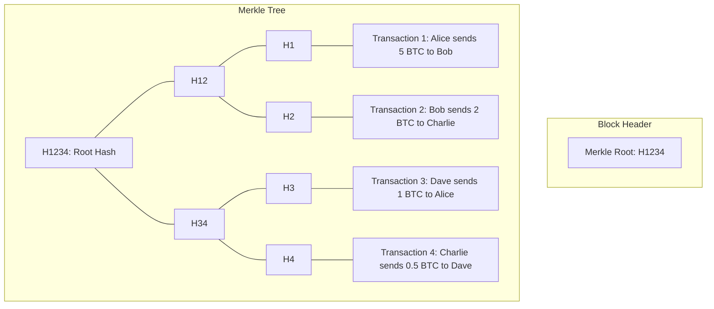
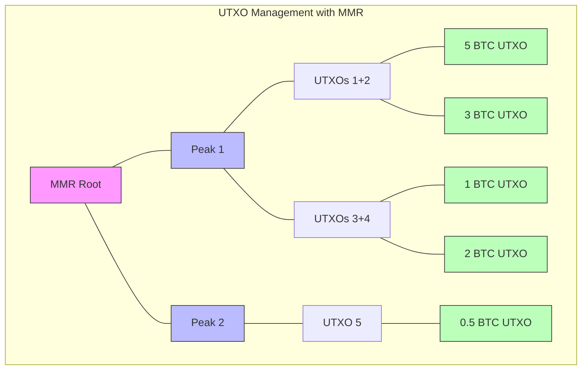
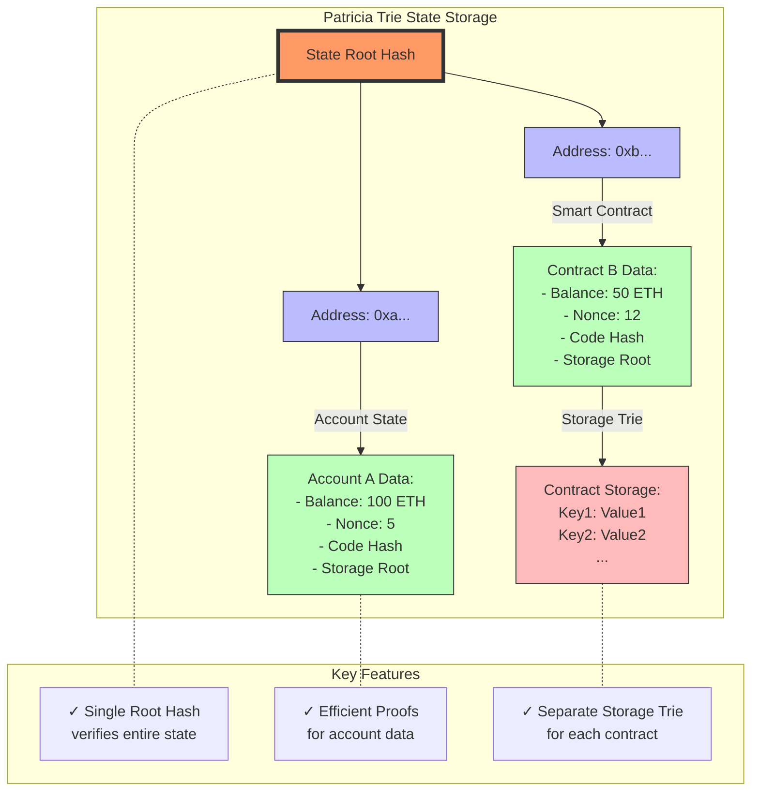

# 1. Cryptography
## 1.1 Kerckhoff's Principle:
A cryptographic system should be secure even if everything about the system, except the key, is public knowledge.

## 1.2 Hashing attacks
* **Preimage Attack**: Given a hash value h, find any message m such that `hash(m) = h`. Trying to find an input that produces a specific target hash
* **Weak Collision Attack (Second Preimage Attack)**: Given a message `m1`, find another message `m2` such that `hash(m1) = hash(m2)`.
* **Strong Collision Attack**: Find any two different messages `m1` and `m2` such that hash(m1) = hash(m2). Can use any two inputs, not tied to a specific input or hash.

## 1.3 Encryption
* Symmetric key encryption is less computationally expensive, so faster, than asymmetric key encryption. 
* So we try to share the symmetric keys securely and then use them for communication. 2 ways to share keys:
    * **Diffie Hellman key exchange**: Both parties involved create unique secret keys. Then they share a common `base` and `modulus` and use modular arithmetic to calculate a shared secret key.
    * **Asymmetric Key Encryption (RSA)**: Here both parties create separate public and private keys. The public key is shared with the other party and the private key is kept secret. Both parties use this secure channel to share a symmetric key.

## 1.4 Wallet and Accounts
* A crypto wallet doesn't store any crypto assets. It stores the private keys which prove ownership of the crypto assets.
* The public key is the wallet address.
* Pneumonic phrases are a way to generate a private key from a random string of words.
* We can't remember a `2048` bit private key, so we use a pass phrase to generate it. The magic here is that we change the base of the private key from `2` to `58` (in case of polkadot) so that the private keys becomes shorter and is easy to remember.
* The specific address format used in polkadot is `SS58` format. `SS58` is a base58 encoding of the public key and it adds `2` bytes at the beginning to "indicate the network". It also adds `2` bytes at the end for `Checksum`.
* **Hard Derived Account**: Has it's own private key and public key. Created with `\\` (2 slashes).
* **Soft Derived Account**: Has it's own public key and shares the private key with the parent account. Created with `/` (1 slash).

## 1.5 Digital Signatures
* A digital signature is a mathematical scheme for verifying the authenticity of a digital message or document.
* Guaranteed properties of a Digital Signature scheme in the context of transactions:
    * **Authenticity**: a valid signature implies that the signer deliberately signed the transaction.
    * **Unforgeability**: it is computationally infeasible to forge a signature without knowledge of the private key.
    * **Non-repudiation**: the signer cannot later deny having signed the message
    * **Integrity**: ensure the transaction data has not been modified
* It consists of 3 algorithms:
    * **Key Generation**: Generate a public and private key pair.
    * **Signing Algorithm**: Uses the private key and the message to create a signature.
    * **Verification Algorithm**: Uses the public key and the original message and the signature to verify if the signature is valid. The signature will only verify correctly if the message hasn't been tampered with and the public key corresponds to the private key that was used to create the signature.
* **In Practice** digital signatures don't sign the entire message. Instead a hash function is used to hash the message and create a `Digest` or `Fingerprint` of fixed length. The reason for this is that Cryptographic hashing functions usually work on fixed size inputs.
* One challenge that Digital signatures address is `Replay Attacks`. A replay attack is when an attacker captures a message and then later re-sends it to the recipient. The recipient can't tell if the message is new or old. To prevent this, Digital signatures often use additional information like `nonces` and `timestamps`/`lifetimes`.
* **Multisig accounts** are accounts that require multiple signatures to authorize a transaction. This is useful for things like other decentralized organizations.

## 1.6 Hash Based Data Structures

### 1.6.1 Hash Chains
* A hash chain is a fundamental data structure used in blockchains to ensure the integrity and immutability of data. It is a sequence of blocks (objects), each containing data and a cryptographic hash of the previous block, forming a chain (could be anything like vector or list). This structure ensures that any alteration in a block would require changes to all subsequent blocks, making it tamper-evident.
* Most blockchain implementations (including major ones like Bitcoin) store blocks in a database or vector and use the hash values for validation, not traversal.

### 1.6.2 Merkle Trees
* Merkle tree also known as hash tree is a data structure used for data verification and synchronization. 
* It is a tree data structure where each non-leaf node is a hash of it’s child nodes. All the leaf nodes are at the same depth and are as far left as possible. 
* Each transaction gets hashed, Hashes are paired and hashed again, Process repeats until single root hash, Root hash goes in block header of the blockchain block.

### 1.6.3 Merkle Mountain Range
* A Merkle Mountain Range (MMR) is a variation of Merkle Trees that allows efficient appending of new elements. Think of it as a collection of perfect binary trees of different heights, forming a "mountain range" profile.
* Efficient appending O(log n), Easy to prove membership, Good for growing datasets, Used in blockchain UTXO sets.

* MMR provides a way for blockchain UTXO management. When new transaction creates UTXOs:
    * Hash the new UTXOs
    * Add to MMR structure
    * Update peaks if needed
* When spending UTXOs:
    * Prove UTXO exists using MMR path
    * Remove spent UTXO
    * Add new UTXOs from transaction

### 1.6.4 Radix/Patricia Tries
* A Patricia Trie (Practical Algorithm To Retrieve Information Coded In Alphanumeric) is a modified trie that compresses nodes with only one child, making it more space-efficient. In blockchains, it's used to store state data efficiently.

